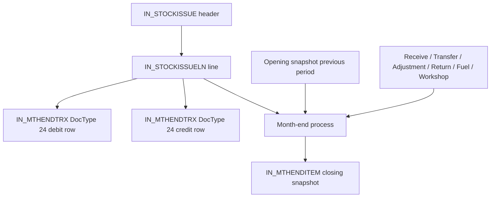

# Inventory Data Model

## Mental Model

Inventory punya 3 layer data:

```text
1. Realtime transaction
   IN_STOCKISSUE + IN_STOCKISSUELN
   = dokumen barang keluar yang dibuat user/proses operasional.

2. Month-end transaction journal
   IN_MTHENDTRX
   = jurnal hasil posting month-end dari transaksi inventory.

3. Month-end snapshot
   IN_MTHENDITEM
   = saldo akhir stok per item/lokasi/periode.
```

## Relasi Utama

```text
IN_STOCKISSUE.StockIssueID
  1 ── n IN_STOCKISSUELN.StockIssueID

IN_STOCKISSUELN.StockIssueLNID
  1 ── 2 IN_MTHENDTRX.DocLnId

IN_STOCKISSUE.StockIssueID
  = IN_MTHENDTRX.DocId

IN_STOCKISSUELN.ItemCode
  = IN_MTHENDTRX.ItemCode
  = IN_MTHENDITEM.ItemCode

IN_STOCKISSUE.LocCode
  = IN_MTHENDTRX.LocCode
  = IN_MTHENDITEM.LocCode
```

## Grain Tiap Tabel

| Table | Grain | Dipakai Untuk |
|---|---|---|
| `IN_STOCKISSUE` | 1 dokumen issue | tanggal posting, status, lokasi sumber, total header |
| `IN_STOCKISSUELN` | 1 item yang keluar | qty keluar, cost, amount, akun/blok/kendaraan pembebanan |
| `IN_MTHENDTRX` | 1 row jurnal | audit posting, debit/credit, akun inventory/expense |
| `IN_MTHENDITEM` | 1 item-lokasi-periode | closing qty, average cost, closing valuation |

## Alur Data



## Case Relasi Satu Line Issue

Data real periode `AccYear = 2027`, `AccMonth = 1`:

```text
IN_STOCKISSUE.StockIssueID      = SI26016036
IN_STOCKISSUELN.StockIssueLNID  = SIL26031950
ItemCode                        = MO03003
Qty                             = 2
Cost                            = 3,750
Amount                          = 7,500
```

Saat masuk `IN_MTHENDTRX`, line ini menjadi dua row:

| Row | DocId | DocLnId | DocType | AccCode | Amount | Makna |
|---:|---|---|---:|---|---:|---|
| 1 | `SI26016036` | `SIL26031950` | `24` | `OC7318` | 7,500 | pembebanan barang dipakai |
| 2 | `SI26016036` | `SIL26031950` | `24` | `CA2118` | -7,500 | inventory berkurang |

Net jurnal = `0`, tapi nilai barang dipakai = `7,500`.

## Periode Accounting

Field periode disimpan sebagai `char`, bukan integer murni:

```sql
RTRIM(AccYear) = '2027'
CAST(RTRIM(AccMonth) AS int) = 1
```

Jangan pakai filter longgar tanpa `RTRIM()` karena field `char` bisa punya trailing spaces.

## Status Realtime Issue

Untuk audit movement yang sudah masuk hitungan, pakai:

```sql
RTRIM(ISNULL(h.Status, '')) IN ('2', '5', '6')
```

Pada audit real periode `2027-1`, semua row issue relevan statusnya `6`.

## DocType `IN_MTHENDTRX`

| DocType | Arti | Relasi |
|---:|---|---|
| `24` | Stock Issue | cocok ke `IN_STOCKISSUE` + `IN_STOCKISSUELN` |
| `25` | Fuel Issue | bukan `IN_STOCKISSUE`; jangan digabung untuk audit issue barang |
| `20` | Stock Adjustment | movement penyesuaian, audit terpisah |

## Rule Audit Cepat

```text
IssueAmount realtime
= SUM(IN_STOCKISSUELN.Amount)
= SUM(IN_MTHENDTRX.Amount WHERE DocType='24' AND Amount > 0)
= ABS(SUM(IN_MTHENDTRX.Amount WHERE DocType='24' AND Amount < 0))
```

```text
SnapshotAmount closing
= SUM(IN_MTHENDITEM.Amount)
= valuasi stok akhir bulan
≠ issue amount realtime
```
