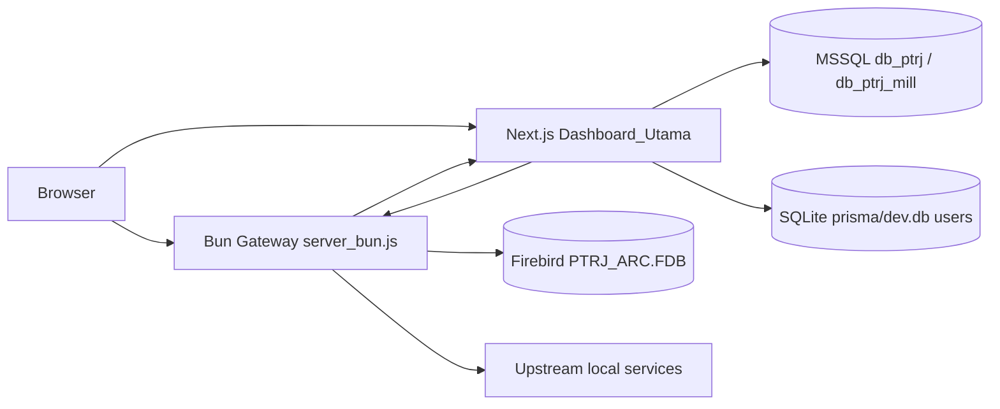
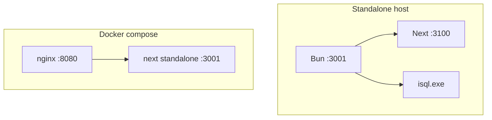
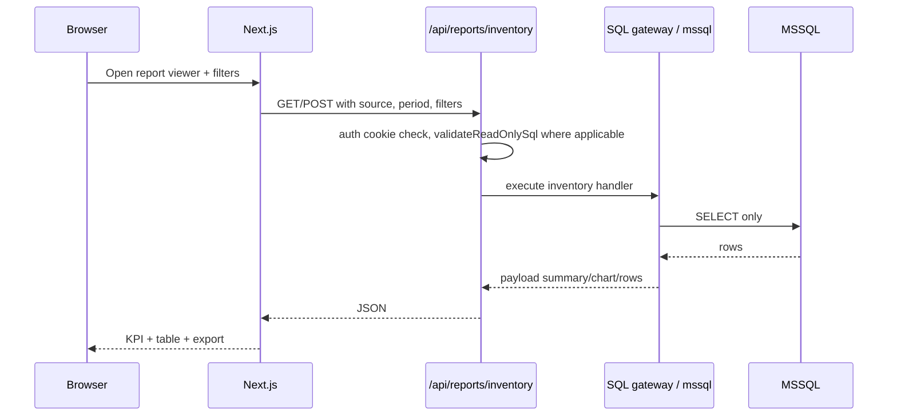
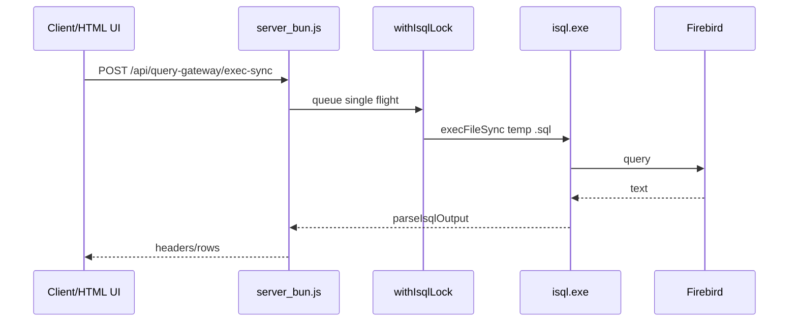
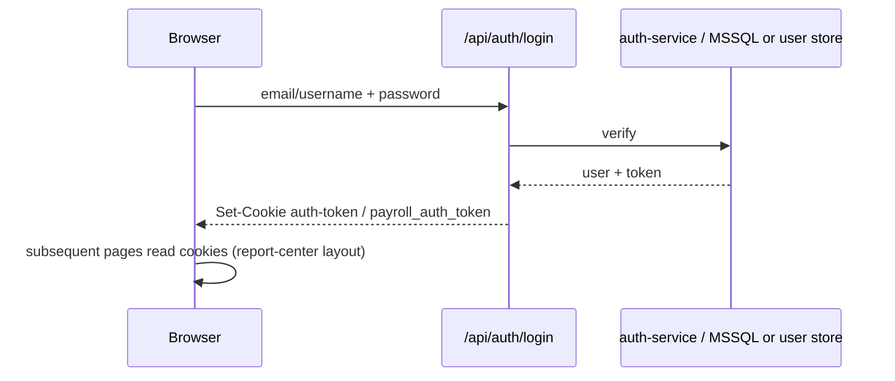

# 03 — Architecture

**Last verified:** 2026-07-21

## System context

## Dual deployment modes

| Mode | Components | Evidence |
|---|---|---|
| **Standalone** | `server_bun.js` reverse proxy + IFESS API + Firebird query gateway; optional spawn Next on 3100 | Root `package.json` scripts, `CLAUDE.md` |
| **Docker** | Next standalone + nginx on 8080 | `Dashboard_Utama/docker-compose.yml`, `Dockerfile` |

## Containers / processes

## Request lifecycles

### Report Center inventory report

### Firebird query gateway

Critical correctness notes (from `CLAUDE.md`):

- Scanner month partitions hold multi-year data; always filter `TRANSDATE` range.
- Serialize isql (Firebird 1.5 single-threaded).
- No window functions / many modern SQL features.

## Authentication flow (dashboard)

## Design decisions (evidence)

| Decision | Why (from code/docs) |
|---|---|
| Bun gateway primary | Active scripts; Express retained legacy |
| Read-only report SQL | `validateReadOnlySql`, DB policy memory |
| Payload-side filters often after SQL | Inventory route applies `applyReportFilters` on payload |
| SQLite Prisma for app users | `prisma/schema.prisma` provider sqlite |
| MSSQL for business reports | `mssql` package + inventory handlers |

## Dev vs production differences

| Topic | Development | Production |
|---|---|---|
| Gateway | `npm run dev` / PORT override | `npm run start` NODE_ENV=production |
| Dashboard | Turbopack `next dev` | `next build` standalone / Docker |
| Cookies | often non-secure | set `COOKIE_SECURE` when HTTPS |
| Routes config | `routes-config.json` | `routes-config.production.json` |

## Related

- [04-project-structure.md](./04-project-structure.md)
- [07-api-reference.md](./07-api-reference.md)
- [diagrams/README.md](./diagrams/README.md)
