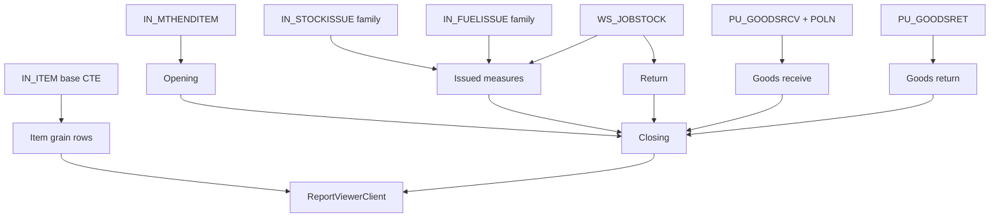

# 11 — Report Detail Experience

**Last verified:** 2026-07-21  
**Focus report:** MONTHLY STOCK ACCOUNT MOVEMENT DETAILS (`RPTIN1000015` / id `monthly-stock-account-movement-details`)

## Purpose and users

| | |
|---|---|
| **Purpose** | Reconstruct monthly stock account movement for mill/estate inventory accounting: opening, issues, returns, purchasing receive/return, closing |
| **Users** | Inventory accounting, procurement controllers, managers reviewing period close |
| **Code** | `RPTIN1000015` | `lib/reports/inventory/monthly-stock-account-movement.ts` |
| **API** | Inventory handler path + dedicated JSON `GET /api/reports/monthly-stock-account-movement-details-json` |
| **UI** | `ReportViewerClient` under `/report-center/inventory/[report]` |

## Header / metadata (from payload metadata builders)

Typical metadata fields set by engine:

- Actual period / accounting period
- Opening actual & accounting periods
- Location scope
- Category codes (`DEADS`, `MEMOV`, `SLMOV` default set)
- Snapshot mode flag (past periods use `IN_MTHENDITEM`)
- Windowing / partial flags when limited

## Period behavior

| Input | Behavior |
|---|---|
| Actual period / `period` | Converted via `accounting-period` helpers |
| Accounting year/month | Used for month-end joins |
| Opening period | Previous accounting period |
| `dateTo` / transaction as-of | Limits in-period transactions to posted/update before as-of (**implemented rule in metadata**) |

## Movement measure dictionary

Statuses from `MONTHLY_MOVEMENT_DEFINITIONS`:

| Field key | User label | Status | Source (code) |
|---|---|---|---|
| `opening` | Opening | implemented | `IN_MTHENDITEM` previous accounting period |
| `received` | Received | **placeholder_zero** | Not implemented in reconstruction |
| `return_advice` | Return Advice | **placeholder_zero** | Not implemented |
| `transferred` | Transferred | **placeholder_zero** | Not implemented |
| `adjustment` | Adjustment | **placeholder_zero** | Not implemented |
| `issued_ledger` | Issued - Ledger | implemented | stock issue + fuel + workshop issue paths |
| `issued_station` | Issued - Station | implemented | same issue family |
| `issued_vehicle` | Issued - Vehicle | implemented | same issue family |
| `issued_total` | Issued - Total | implemented | ledger+station+vehicle |
| `return` | Return | implemented | `WS_JOBSTOCK` TransType 2 |
| `purchasing_goods_receive` | Purchasing - Goods Receive | implemented | `PU_GOODSRCV*` + `PU_POLN` cost |
| `purchasing_goods_return` | Purchasing - Goods Return | implemented | `PU_GOODSRET*` (doc drift: older docs still said placeholder) |
| `purchasing_dispatch_advice` | Purchasing - Dispatch Advice | **placeholder_zero** | Not implemented |
| `closing` | Closing | implemented | Official `IN_MTHENDITEM` prefer; else reconstruct |

### Formula rules (verified from code comments/metadata)

| Metric | Formula / rule | Null handling |
|---|---|---|
| Opening qty/amt | From previous period `IN_MTHENDITEM` | Amount fallback `Qty * AverageCost` when amount null |
| Issued total | Sum of ledger + station + vehicle issue measures | 0 if missing |
| Closing (official) | `IN_MTHENDITEM` for report AccYear/AccMonth when present | Uses reconstructed when snapshot missing |
| Closing (reconstruct) | `opening + received + return_advice + transferred + adjustment - issued_total + return + goods_receive - goods_return - dispatch_advice` | Placeholder components contribute 0 today |
| On-hand hold valuation | QtyOnHand+Hold style valuation metrics in analytics band | See analytics builder |

**Unverified without DBA sign-off:** exact business equivalence to legacy Crystal/RPT binary for every edge case.

## Data lineage



## Filters / scope

| Control | Effect |
|---|---|
| `source` | estate vs pabrik DB |
| `period` / accounting | Month selection |
| `location` | Location filter when provided |
| Stock analysis codes | Default DEADS/MEMOV/SLMOV; overridable |
| `search` | Item search |
| `limit` | Row window (JSON route 1..20000, default 500) |
| Semantic groupBy dimensions | Via shared filter input when used by viewer |

## Viewer capabilities (shared ReportViewerClient)

- Natural language filter
- Manual filter builder / chips
- Sort, group, aggregate, top N
- Column visibility, density, fullscreen
- KPI cards that can apply presets
- Export Excel/PDF
- SQL/debug surfaces for privileged technical inspection (**role gate Unverified end-to-end**)

## UI states

| State | Behavior |
|---|---|
| Loading | Skeletons / spinners |
| Empty | No rows for filter |
| Partial | `metadata.windowed` / returnedRows < filteredRows |
| Error | JSON `{ error }` → error panel |
| Placeholder columns | Show zeros; status `placeholder_zero` in nested JSON column_definitions |

## Nested JSON API

`GET /api/reports/monthly-stock-account-movement-details-json`

Returns `adaptMonthlyStockMovementNestedResponse(payload)` with:

- `metadata`
- `column_definitions` (key/label/units/status)
- `stock_analyses` totals
- `items[]` with `movements` map

## Performance notes

- Prefer snapshot mode for past months (`IN_MTHENDITEM`) vs live `IN_ITEM`.
- Cap limits; avoid cross-union DISTINCT patterns on Firebird (different stack).
- Detail performance helpers: `lib/reports/report-detail-performance.ts`.

## Related tests

```bash
npx tsx lib/reports/inventory/monthly-stock-account-movement.test.ts
npx tsx lib/reports/accounting-period.test.ts
npx tsx lib/reports/movement-category.test.ts
```
