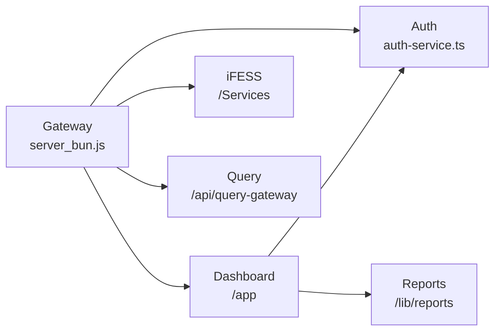

# Module Map

## Module Status Table

| Module | Purpose | Main Files | Database | API Routes | Status |
|--------|---------|------------|----------|------------|--------|
| **Gateway** | Reverse proxy, auth | `server_bun.js` | - | All | ✅ Implemented |
| **Auth** | User login/logout | `lib/utils/auth-service.ts` | MSSQL users | `/api/auth/*` | ✅ Implemented |
| **Dashboard** | Admin UI | `app/(login)/admin/` | - | - | ✅ Implemented |
| **Report Center** | View reports | `app/(report-center)/` | MSSQL | `/api/reports/*` | ✅ Implemented |
| **Inventory Reports** | Stock management | `lib/reports/inventory/` | MSSQL | `/api/reports/inventory` | ✅ Implemented |
| **AI Insights** | Report analysis | `lib/reports/intelligence.ts` | - | `/api/reports/ai-*` | ✅ Implemented |
| **iFESS Control** | Client management | `Services/ifess-control-server/` | JSON | `/api/ifess/*` | ✅ Implemented |
| **Query Gateway** | Firebird SQL | `server_bun.js` (inline) | Firebird | `/api/query-gateway/*` | ✅ Implemented |
| **Landing Page** | Public landing | `app/(landing-page)/` | - | - | ✅ Implemented |
| **Executive Dashboard** | Executive view | `app/(login)/admin/executive/` | - | - | ✅ Implemented |
| **Prisma ORM** | ORM (unused?) | `package.json` | - | - | ⚠️ Partial/Unused |

## Service Modules

| Service | Purpose | Main File | Dependencies | Status |
|---------|---------|----------|--------------|--------|
| UserService | User CRUD | `lib/utils/auth-service.ts` | MSSQL | ✅ Implemented |
| ReportService | Report generation | `lib/reports/*.ts` | MSSQL | ✅ Implemented |
| IFESSService | Client management | `Services/ifess-control-server/service.js` | JSON | ✅ Implemented |
| QueryService | Firebird queries | `server_bun.js` | Firebird isql | ✅ Implemented |
| SyncService | Data synchronization | `lib/ifess-sync/` | iFESS API | ✅ Implemented |

## Report Modules

| Module ID | Name | Reports | Status |
|-----------|------|---------|--------|
| procurement | Procurement | Live inventory | ✅ Active |
| financial | Financial | 16 reports | ✅ Active |
| human-resources | Human Resources | 94 reports | ✅ Active |
| budget | Budget | 12 reports | ✅ Active |

## iFESS Modules

| Module | Purpose | Status |
|--------|---------|--------|
| Client Registration | Register desktop clients | ✅ Implemented |
| Heartbeat | Client keep-alive | ✅ Implemented |
| Command Dispatch | Send commands to clients | ✅ Implemented |
| Query Templates | Pre-built SQL templates | ✅ Implemented |
| Data Sync | Sync data from clients | ✅ Implemented |

## Upstream Service Modules

| Service | Port | Proxied Path | Status |
|---------|------|--------------|--------|
| Payroll | 5175/8002 | `/upah`, `/backend/upah` | ✅ Enabled |
| Attendance | 5176 | `/absen` | ✅ Enabled |
| Rice Monitor | 5177 | `/monitoring-beras` | ✅ Enabled |
| Google Drive | 5178 | `/file` | ✅ Enabled |
| SQL Gateway | 8001 | `/query` | ✅ Enabled |
| iFESS Client | 8003 | `/ifess` | ✅ Enabled |

## Unused/Deprecated Modules

| Module | Status | Evidence | Recommendation |
|--------|--------|----------|----------------|
| Express gateway (`server.js`) | Legacy | Not primary gateway | Deprecate |
| NextAuth | Partial | Only route exists | Audit usage |
| Prisma ORM | Unused | Imported but not used | Remove if not needed |

## Module Dependencies

---

**Evidence**: Codebase scan, `CLAUDE.md`, `lib/reports/config.ts`
