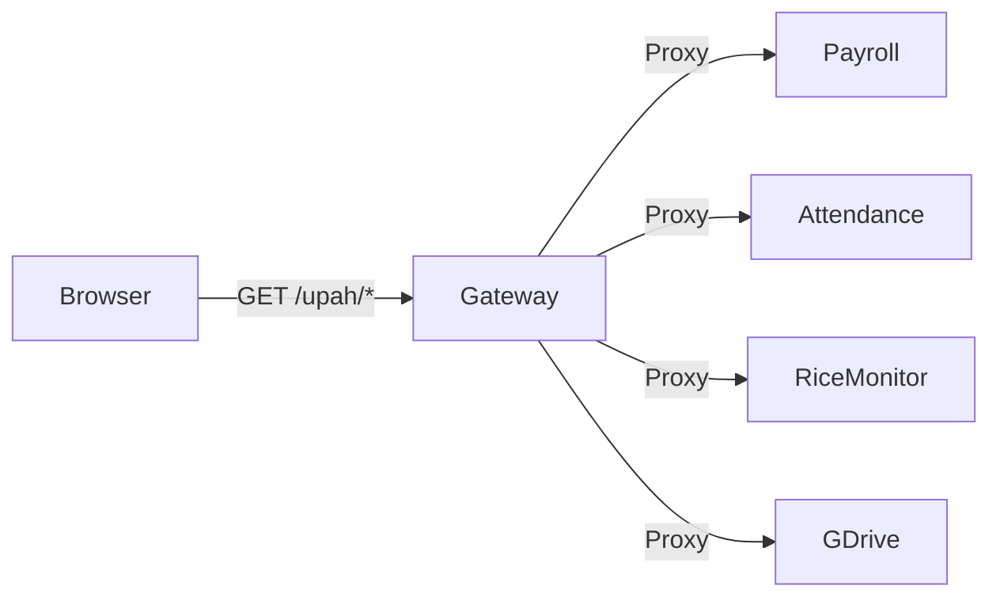
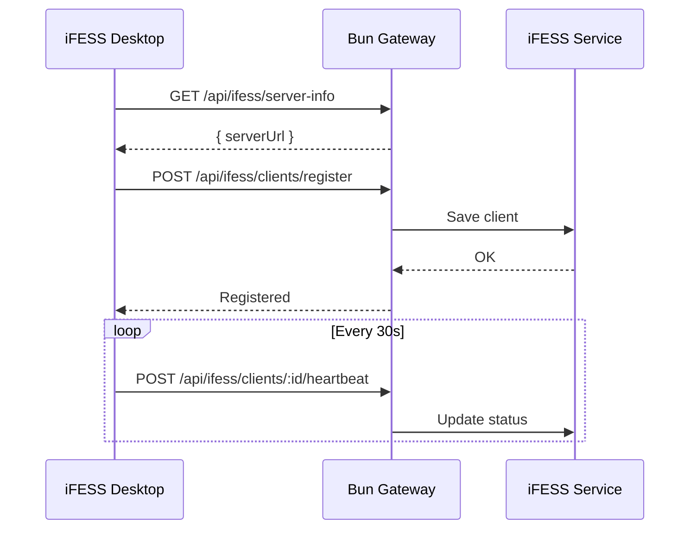

# Integration Context

## Upstream Services

### Service Proxy Architecture



### Service Configuration

| Service | Port | Proxy Path | Rewrite | Health |
|---------|------|------------|---------|--------|
| Payroll | 5175/8002 | `/upah` | Yes | - |
| Attendance | 5176 | `/absen` | No | - |
| Rice Monitor | 5177 | `/monitoring-beras` | No | - |
| Google Drive | 5178 | `/file` | Yes | - |

## Payroll Integration

### Path Mappings

| External Path | Internal Path | Purpose |
|---------------|---------------|---------|
| `/upah` | `/upah/*` | Payroll UI |
| `/backend/upah` | Direct | Payroll API |
| `/auth` | - | Auth endpoints |
| `/payroll` | - | Payroll routes |
| `/employees` | - | Employee data |

### Static Assets

| Path | Source | Type |
|------|--------|------|
| `/upah/assets/*` | External dist | Immutable |
| `/upah/images/*` | External assets | Cacheable |
| `/upah/vite.svg` | External | Static |

## Attendance Integration

| Property | Value |
|----------|-------|
| Port | 5176 |
| Path | `/absen` |
| Purpose | Employee attendance tracking |
| Auth | Integrated with main auth |

## Google Drive Integration

| Property | Value |
|----------|-------|
| Port | 5178 |
| Path | `/file` |
| Purpose | Document storage and retrieval |
| Auth | Service-specific |

## iFESS Desktop Integration

### Client Communication



### Client Types (Implied)

| Client Type | Description | Data Collected |
|-------------|-------------|----------------|
| Attendance Scanner | Gate watch device | Employee scans |
| Harvest Scanner | FFB weighing device | Harvest data |
| Field Device | Field data collection | Various |

## Database Integrations

### MSSQL Connection

```typescript
const pool = new sql.ConnectionPool({
  server: process.env.MSSQL_HOST,
  database: process.env.MSSQL_DATABASE,
  options: {
    encrypt: false,
    trustServerCertificate: true
  }
});
```

### Firebird Connection

```bash
# Via isql.exe CLI
isql.exe localhost:PATH/TO/PTRJ_ARC.FDB \
  -u SYSDBA \
  -p masterkey \
  -q \
  -i query.sql
```

## External Dependencies

| Dependency | Purpose | Version |
|-----------|---------|---------|
| MSSQL Server | Business database | Unknown |
| Firebird 1.5 | Scanner data | 1.5 |
| npm packages | Frontend deps | See package.json |

## Integration Status

| Service | Status | Last Verified |
|---------|--------|---------------|
| Payroll | ✅ Active | Unknown |
| Attendance | ✅ Active | Unknown |
| Rice Monitor | ✅ Active | Unknown |
| Google Drive | ✅ Active | Unknown |
| iFESS Desktop | ✅ Active | Unknown |

---

**Evidence**: `routes-config.json`, `CLAUDE.md`
