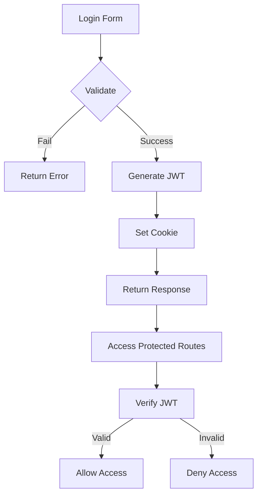

# Security & Privacy Audit

## Security Findings

### Critical Findings

| ID | Issue | Risk | Evidence | Recommendation |
|----|-------|------|---------|----------------|
| SEC-001 | Default API keys in source | Critical | `server_bun.js` has hardcoded keys | Move to env vars, rotate keys |
| SEC-002 | Hardcoded DB credentials | Critical | `.env.production` | Use secrets manager |

### High Findings

| ID | Issue | Risk | Evidence | Recommendation |
|----|-------|------|---------|----------------|
| SEC-003 | No rate limiting | High | No middleware found | Add rate limiter |
| SEC-004 | SQL injection risk | High | Raw SQL in queries | Use parameterized queries |
| SEC-005 | No input sanitization | High | User input in reports | Validate all inputs |

### Medium Findings

| ID | Issue | Risk | Evidence | Recommendation |
|----|-------|------|---------|----------------|
| SEC-006 | HTTP cookies not secure | Medium | `secure: false` | Enable HTTPS in prod |
| SEC-007 | No CSRF protection | Medium | SameSite: lax only | Add CSRF tokens |
| SEC-008 | Token without refresh | Medium | 8hr fixed expiry | Add refresh mechanism |

### Low Findings

| ID | Issue | Risk | Evidence | Recommendation |
|----|-------|------|---------|----------------|
| SEC-009 | No audit logging | Low | No user action logs | Add audit trail |
| SEC-010 | Error messages exposed | Low | Stack traces in dev | Sanitize errors in prod |

## Privacy Findings

### Data Handling

| Data Type | Storage | Retention | Protection |
|-----------|---------|-----------|------------|
| User credentials | MSSQL | Permanent | bcrypt hashed |
| JWT tokens | Cookie | 8 hours | HTTPOnly (partial) |
| Employee data | MSSQL | Permanent | DB-level only |
| Attendance data | Firebird | Permanent | DB-level only |

### Sensitive Fields

| Field | Sensitivity | Notes |
|-------|-------------|-------|
| Password | High | bcrypt hashed |
| NIK (employee ID) | Medium | Indonesian ID number |
| Salary data | High | Payroll information |
| Location data | Medium | Estate/field locations |

## Security Controls

### Implemented

| Control | Status | Evidence |
|---------|--------|----------|
| Password hashing | ✅ | bcryptjs |
| JWT RS256 | ✅ | RSA keypair |
| HTTPS redirect | ⚠️ | Only when `secure: true` |
| SQL read-only | ⚠️ | validateReadOnlySql exists |

### Missing

| Control | Status | Priority |
|---------|--------|----------|
| Rate limiting | ❌ | High |
| CSRF tokens | ❌ | Medium |
| Input sanitization | ❌ | High |
| Audit logging | ❌ | Medium |
| Secrets manager | ❌ | Critical |

## Authentication Flow

## Token Security

| Aspect | Implementation | Rating |
|--------|----------------|--------|
| Algorithm | RS256 (RSA-SHA256) | ✅ Good |
| Expiry | 8 hours | ⚠️ Long |
| Storage | HTTP Cookie | ⚠️ Vulnerable to XSS |
| Refresh | None | ❌ Risk |

## Recommendations

### Immediate (Critical)

1. **Rotate all API keys** - Generate new keys, update all services
2. **Move secrets to vault** - Use environment-specific secrets manager
3. **Enable HTTPS** - Set `COOKIE_SECURE=true` in production

### Short-term (High Priority)

4. **Add rate limiting** - Protect against brute force
5. **Parameterize queries** - Prevent SQL injection
6. **Validate all inputs** - Use Zod schemas

### Medium-term

7. **Add CSRF protection**
8. **Implement refresh tokens**
9. **Add audit logging**
10. **Security headers** - CSP, X-Frame-Options, etc.

---

**Evidence**: Code analysis, `server_bun.js`, `auth-service.ts`
