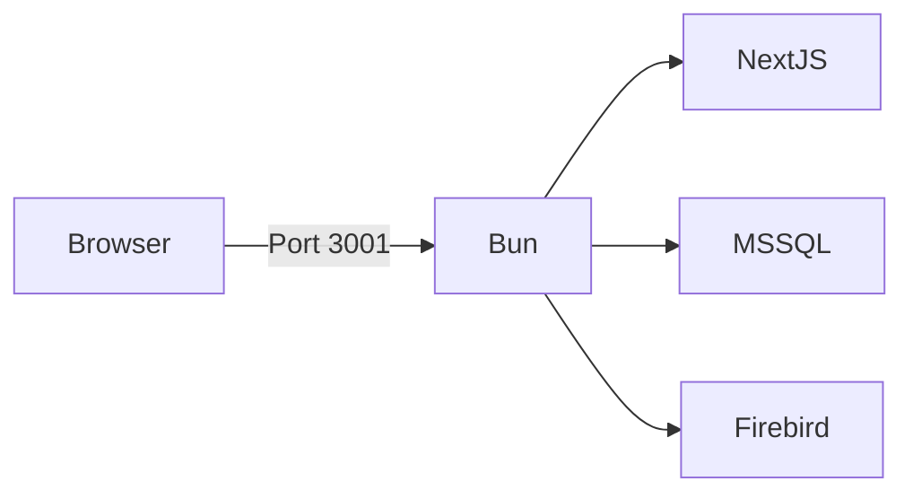
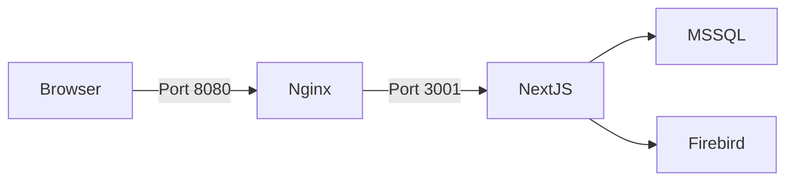

# Deployment Context

## Deployment Modes

### Standalone Mode



**Pros**: Simple, single server
**Cons**: Manual scaling

### Docker Mode



**Pros**: Isolated, portable
**Cons**: Additional complexity

## Docker Deployment

### docker-compose.yml

```yaml
services:
  dashboard:
    build: .
    ports:
      - "3001:3001"
    environment:
      - NODE_ENV=production
    volumes:
      - ./keys:/app/keys
      - ./data:/app/data
    depends_on:
      - mssql
    networks:
      - dashboard-net

  nginx:
    image: nginx:alpine
    ports:
      - "8080:80"
    volumes:
      - ./nginx.conf:/etc/nginx/nginx.conf
    depends_on:
      - dashboard
    networks:
      - dashboard-net

networks:
  dashboard-net:
    driver: bridge
```

### Dockerfile

```dockerfile
# Stage 1: Builder
FROM node:20-alpine AS builder
WORKDIR /app
COPY package*.json ./
RUN npm ci
COPY . .
RUN npm run build

# Stage 2: Runner
FROM node:20-alpine
WORKDIR /app
COPY --from=builder /app/public ./public
COPY --from=builder /app/.next ./.next
COPY --from=builder /app/node_modules ./node_modules
COPY --from=builder /app/package*.json ./
EXPOSE 3001
USER node
CMD ["node", "server.js"]
```

## Build Process

### Development Build

```bash
# Install dependencies
npm install

# Start dev server
npm run dev
```

### Production Build

```bash
# Build Next.js
npm run build:dashboard

# Or build standalone
cd Dashboard_Utama
npm run build
```

## Deployment Checklist

### Pre-deployment

- [ ] Run tests: `npx tsx lib/reports/*.test.ts`
- [ ] Type check: `npx tsc --noEmit`
- [ ] Lint: `npm run lint`
- [ ] Build: `npm run build`

### Deployment

- [ ] Backup database
- [ ] Deploy code
- [ ] Restart services
- [ ] Verify health endpoint
- [ ] Test login flow

### Post-deployment

- [ ] Check logs for errors
- [ ] Verify reports load
- [ ] Test iFESS connectivity

## Environment-Specific Config

### Development

```bash
NODE_ENV=development
PORT=3001
START_DASHBOARD=true
```

### Staging

```bash
NODE_ENV=staging
PORT=3001
START_DASHBOARD=false
COOKIE_SECURE=true
```

### Production

```bash
NODE_ENV=production
PORT=3001
START_DASHBOARD=false
COOKIE_SECURE=true
MSSQL_HOST=10.0.0.110
```

## Rollback Procedure

1. Identify working version from git tags
2. Revert code: `git revert <commit>`
3. Redeploy
4. Verify functionality

---

**Evidence**: `Dockerfile`, `docker-compose.yml`, `package.json`
