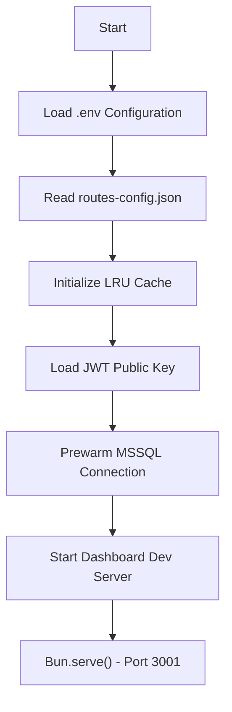
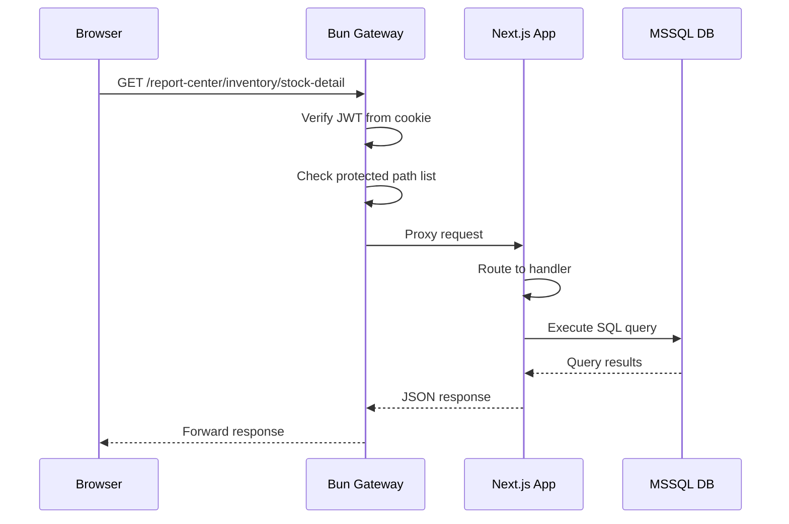
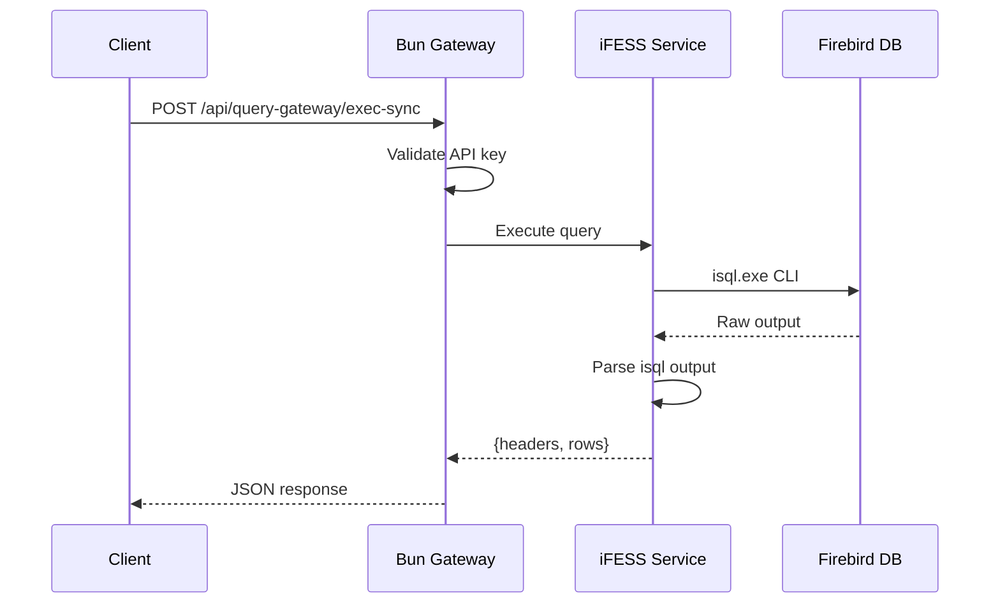

# Backend Architecture

## Application Startup

### Bun Gateway (`server_bun.js`)



**Startup Flow** (`server_bun.js`):
1. Load environment variables from `.env.{NODE_ENV}` or `.env`
2. Read proxy routes from `routes-config.json` (hot-reload on change)
3. Initialize LRU cache for static assets
4. Load RSA public key for JWT verification
5. Optionally prewarm MSSQL connection pool
6. Optionally spawn Next.js dev server on port 3100
7. Start Bun HTTP server on configured port

### Next.js App

```bash
# Production (via Bun spawn)
node server.js  # Starts on port 3001

# Development
cd Dashboard_Utama && npm run dev  # Next.js dev on port 3000
```

## Modules and Services

### Gateway Modules (`server_bun.js`)

| Module | Location | Purpose |
|--------|----------|---------|
| Reverse Proxy | Lines 200-600 | Route matching, content rewriting |
| JWT Auth | Lines 100-150 | Token verification, user extraction |
| IFESS Control | Lines 700-900 | Client management API |
| Query Gateway | Lines 800-1000 | Firebird SQL execution |
| Static Handler | Lines 400-500 | File serving with caching |

### iFESS Control Server (`Services/ifess-control-server/`)

| Module | File | Purpose |
|--------|------|---------|
| Auth | `auth.js` | API key validation |
| Routes | `routes.js` | HTTP request handlers |
| Service | `service.js` | Business logic, data persistence |

### Report System (`lib/reports/`)

| Module | File | Purpose |
|--------|------|---------|
| Config | `config.ts` | Module registry |
| Intelligence | `intelligence.ts` | AI insights |
| Filtering | `report-filtering.ts` | SQL builder, filters |
| Movement | `movement-category.ts` | Stock categorization |

## Request Lifecycle

### Dashboard Request Flow



### API Request Flow



## Authentication and Authorization

### JWT Authentication

**Location**: `server_bun.js:100-150`

```javascript
// JWT Verification (RS256)
const JWT_PUBLIC_KEY = readFileSync(`${ROOT_DIR}/keys/public.pem`, 'utf-8');

function verifyJWT(token) {
    // 1. Split token into parts
    // 2. Verify signature with RSA public key
    // 3. Check expiration
    // 4. Return payload or null
}
```

**Token Extraction**:
- From `auth-token` cookie
- From `Authorization: Bearer <token>` header

**Protected Paths**:
- `/admin/*`, `/dashboard/*`, `/report-center/*`
- `/api/services/*`, `/api/reports/*`
- `/ifess-control/*`, `/api/ifess/*`, `/api/query-gateway/*`

### iFESS API Key Authentication

| Header | Environment Variable | Default |
|--------|---------------------|---------|
| `X-API-Key` | `IFESS_API_KEY` | `ptrj-rebinmas-air-ruak-parit-gunung-darul` |
| `X-API-Key` | `QUERY_API_KEY` | `ptrj-query-gateway-key` |
| `X-API-Key` | `UPATH_API_KEY` | `ptrj-upath-key` |

## Error Handling

### Gateway Error Responses

```typescript
// Unauthorized (401)
{ error: 'Unauthorized' }

// Forbidden (403)
{ error: 'Access denied' }

// Not Found (404)
{ error: 'Route not found' }

// Internal Error (500)
{ error: 'Internal server error' }
```

### Next.js API Error Handling

```typescript
// lib/utils/error-handler.ts pattern
try {
    const result = await operation();
    return NextResponse.json(result);
} catch (error) {
    console.error('Operation failed:', error);
    return NextResponse.json(
        { error: 'Operation failed' },
        { status: 500 }
    );
}
```

## Background Processing

### Scheduled Tasks

| Task | Schedule | Purpose |
|------|----------|---------|
| Health Check | Every 30s | Monitor service health |
| Heartbeat Cleanup | Every 5min | Remove stale clients |
| Config Hot-Reload | On file change | Reload routes-config.json |

### Connection Pooling

**MSSQL Pool**:
```javascript
const pool = new sql.ConnectionPool({
    server: process.env.MSSQL_HOST,
    database: process.env.MSSQL_DATABASE,
    port: parseInt(process.env.MSSQL_PORT),
    options: {
        encrypt: false,
        trustServerCertificate: true
    }
});
```

**Firebird Lock** (`withIsqlLock`):
- Promise-chain queue
- Max 1 concurrent query
- Prevents DB lock contention

## Key Files Reference

| File | Lines | Purpose |
|------|-------|---------|
| `server_bun.js` | ~195,841 | Main gateway |
| `Services/ifess-control-server/service.js` | ~64,623 | iFESS business logic |
| `Services/ifess-control-server/routes.js` | ~17,074 | iFESS HTTP handlers |
| `Dashboard_Utama/lib/utils/auth-service.ts` | ~50 | User authentication |
| `Dashboard_Utama/lib/reports/config.ts` | ~2,257 | Report module registry |

---

**Evidence**: `server_bun.js:1-195`, `Services/ifess-control-server/service.js`, `CLAUDE.md`
