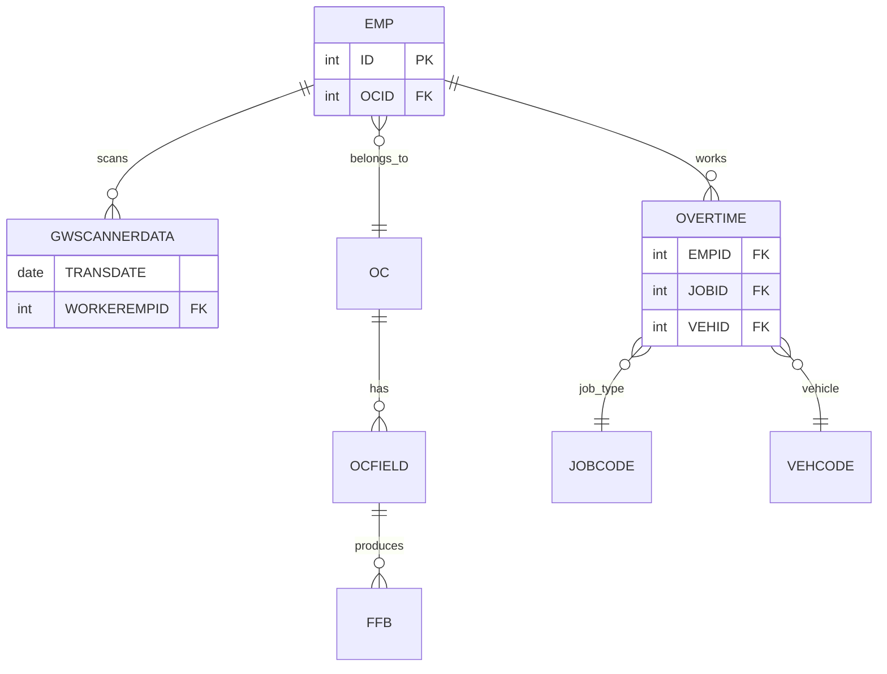
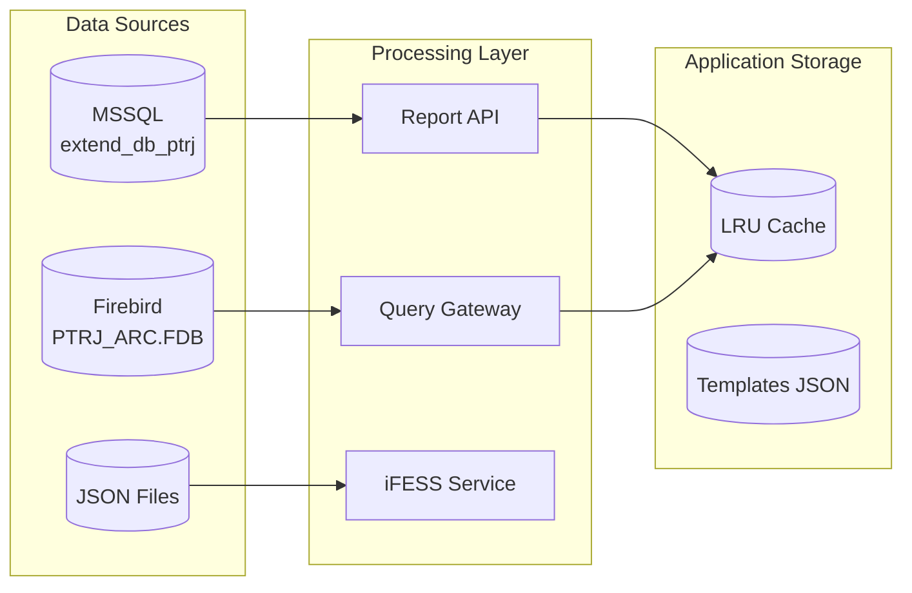

# Data Model

## Database Technologies

| Database | Type | Purpose | Connection |
|----------|------|---------|------------|
| MSSQL (extend_db_ptrj) | SQL Server | Primary business data | TCP/IP |
| Firebird (PTRJ_ARC.FDB) | Embedded | Scanner/production data | CLI (isql) |
| JSON Files | File-based | iFESS configuration | File I/O |

## MSSQL Database (extend_db_ptrj)

### Users Table (Implied from auth)

| Field | Type | Nullable | Purpose |
|-------|------|----------|---------|
| id | INT | No | Primary key |
| email | VARCHAR(255) | No | Login email |
| password | VARCHAR(255) | No | Hashed password (bcrypt) |
| name | VARCHAR(255) | No | Display name |
| role | VARCHAR(50) | No | User role |
| created_at | DATETIME | No | Creation timestamp |

**Source**: `Dashboard_Utama/lib/utils/auth-service.ts`

### Report-Related Tables (Inferred)

| Table | Purpose | Source |
|-------|---------|--------|
| StockIn | Stock inbound transactions | Inventory reports |
| StockOut | Stock outbound transactions | Inventory reports |
| Stock | Current stock levels | Inventory reports |
| StockIssueEvent | Stock movement events | Movement analysis |

**Source**: `Dashboard_Utama/lib/reports/inventory/config.ts`, `lib/reports/report-filtering.ts`

### Report Data Sources

| Source Param | Database | Purpose |
|--------------|----------|---------|
| `pabrik` | db_ptrj_mill | Mill/Factory operations |
| `estate` | db_ptrj | Plantation operations |

**Source**: `CLAUDE.md` - Report System section

## Firebird Database (PTRJ_ARC.FDB)

### Scanner Data Tables (Partitioned by Month)

| Table Pattern | Purpose | Partition |
|--------------|---------|-----------|
| `FFBSCANNERDATA01..12` | FFB Harvest Scanner | Monthly slots |
| `GWSCANNERDATA01..12` | Gate Watch Scanner | Monthly slots |
| `RTSCANNERDATA01..12` | Rubber Tap Scanner | Monthly slots |

**Important**: `#MONTH#` placeholder selects partition slot, NOT calendar month.

**Source**: `CLAUDE.md` - Firebird Query Gateway section

### Scanner Table Schema (Example: GWSCANNERDATA01)

| Field | Type | Description |
|-------|------|-------------|
| TRANSDATE | DATE | Transaction date |
| WORKEREMPID | INTEGER | Employee ID (FK → EMP.ID) |
| SCANTIME | TIME | Scan timestamp |

**Source**: `CLAUDE.md` - DB facts

### Core Tables

| Table | Purpose | Key Fields |
|-------|---------|-----------|
| EMP | Employee master | ~5915 rows, FK: OCID |
| OC | Organization Code | Company/division |
| OCFIELD | Field/Estate | FK: OCID |
| OVERTIME | Overtime records | ~72k rows, FK: EMPID, JOBID, VEHID |
| SALARYSCALE | Wage rates | Used for EstCost calculation |

### Table Relationships



## iFESS Data Storage (JSON Files)

### Location: `data/ifess/`

| File | Purpose | Structure |
|------|---------|-----------|
| `clients.json` | Registered desktop clients | Array of client objects |
| `configs.json` | Server configurations | Key-value config |
| `commands.json` | Pending commands | Array of command objects |
| `module-statuses.json` | Module states | Array of status objects |
| `heartbeat-logs.json` | Heartbeat history | Array of log entries |
| `query-templates.json` | SQL templates | Array of template objects |
| `query-results.json` | Query results cache | Array of result objects |

### Client Schema

```typescript
interface Client {
  id: string;           // Unique client ID
  name: string;         // Display name
  os: string;           // Operating system
  version: string;       // App version
  status: 'online' | 'offline';
  registeredAt: string;  // ISO timestamp
  lastHeartbeat: string; // ISO timestamp
}
```

### Query Template Schema

```typescript
interface QueryTemplate {
  templateCode: string;      // Unique identifier
  templateName: string;      // Display name
  description: string;       // Purpose description
  queryText: string;         // SQL query with #VAR# placeholders
  defaultMaxRows: number;    // Default row limit
  defaultTimeoutSeconds: number;
  tags: string[];            // Category tags
  enabled: boolean;
  createdBy: string;
  createdAt: string;
  updatedAt: string;
}
```

## Report Configuration

### Module Registry (`lib/reports/config.ts`)

| Module ID | Name | Reports | Status |
|-----------|------|---------|--------|
| procurement | Procurement | Live inventory | Active |
| financial | Financial | 16 reports | Active |
| human-resources | Human Resources | 94 reports | Active |
| budget | Budget | 12 reports | Active |

**Source**: `Dashboard_Utama/lib/reports/config.ts`

### Movement Categories

| Category | Condition | Description |
|----------|-----------|-------------|
| Fast Moving | `count >= 6` | High activity |
| Moving | `2 <= count <= 5` | Normal activity |
| Slow Moving | `count = 1` | Low activity |
| Dead Stock | `count = 0, stock > 0` | No recent movement |
| No Movement | `count = 0, stock = 0` | Empty with no activity |

**Source**: `CLAUDE.md` - MovementCategory definition

## Database Connection Configuration

### MSSQL Connection

```typescript
// Environment Variables
MSSQL_HOST=10.0.0.110      // Server IP
MSSQL_PORT=1433            // Default port
MSSQL_DATABASE=extend_db_ptrj  // Database name
MSSQL_USER=sa               // Username
MSSQL_PASSWORD=<secret>     // Password

// Connection Pool
{
  encrypt: false,
  trustServerCertificate: true,
  connectionTimeout: 15000,
  requestTimeout: 30000
}
```

### Firebird Connection

```bash
# Connection via isql.exe
isql.exe localhost:PTRJ_ARC.FDB -u SYSDBA -p masterkey -q -i query.sql

# Default credentials
Username: SYSDBA
Password: masterkey
Database: PTRJ_ARC.FDB
```

## Data Flow



---

**Evidence**: `CLAUDE.md`, `lib/reports/config.ts`, `lib/utils/auth-service.ts`, `server_bun.js`
