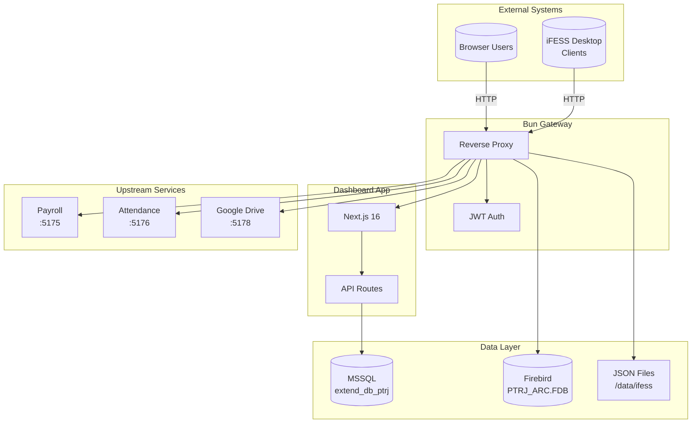
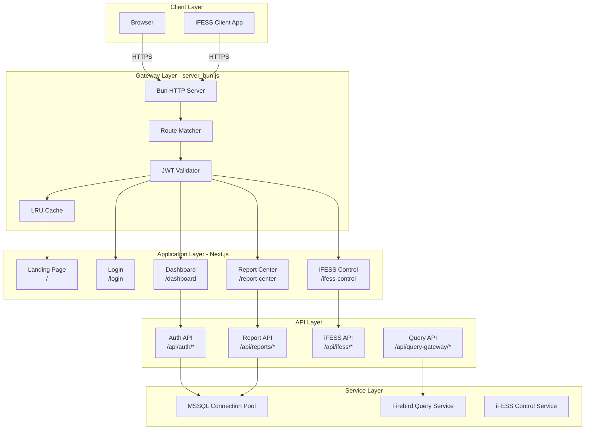
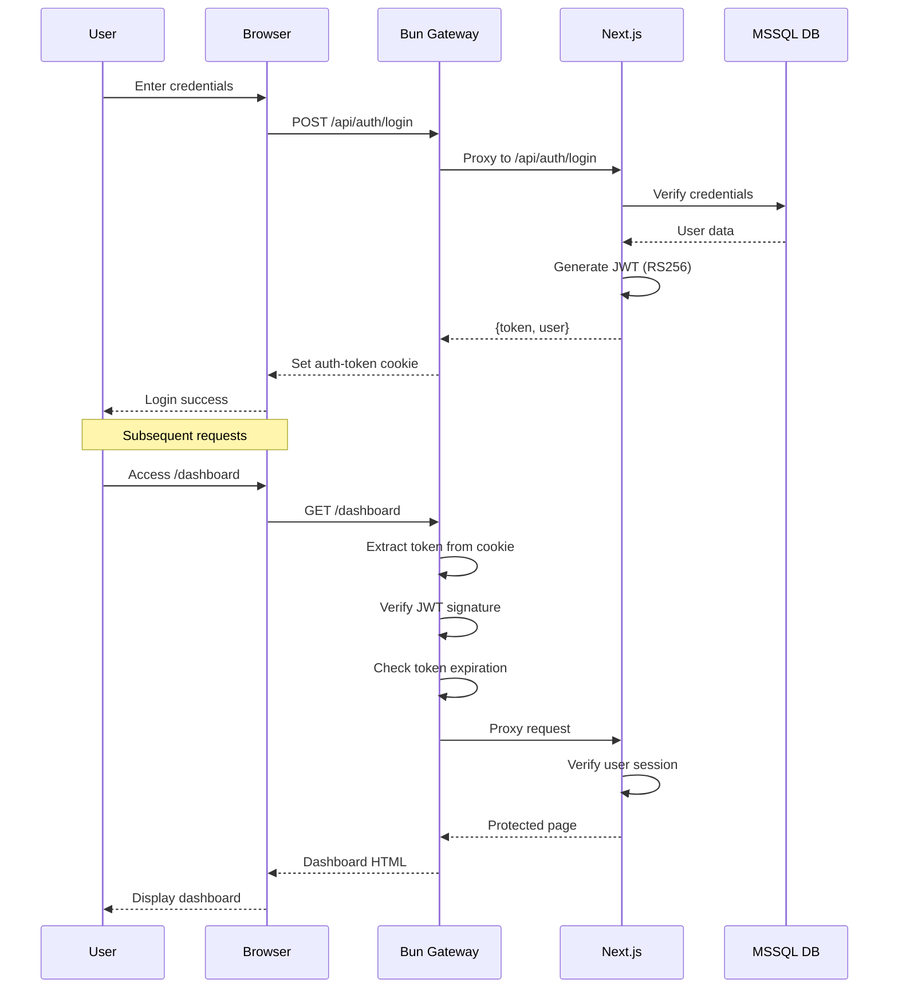
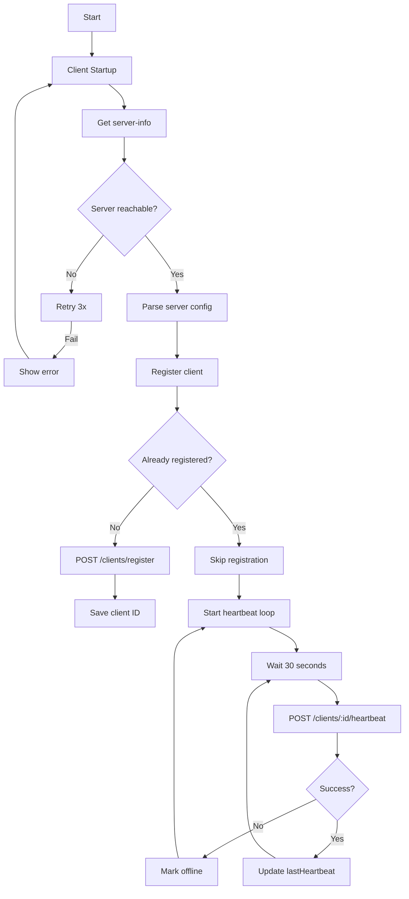
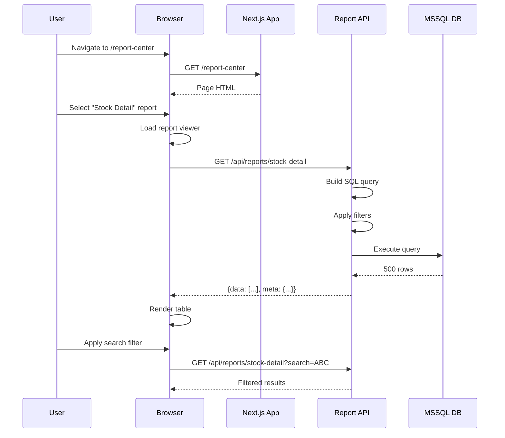
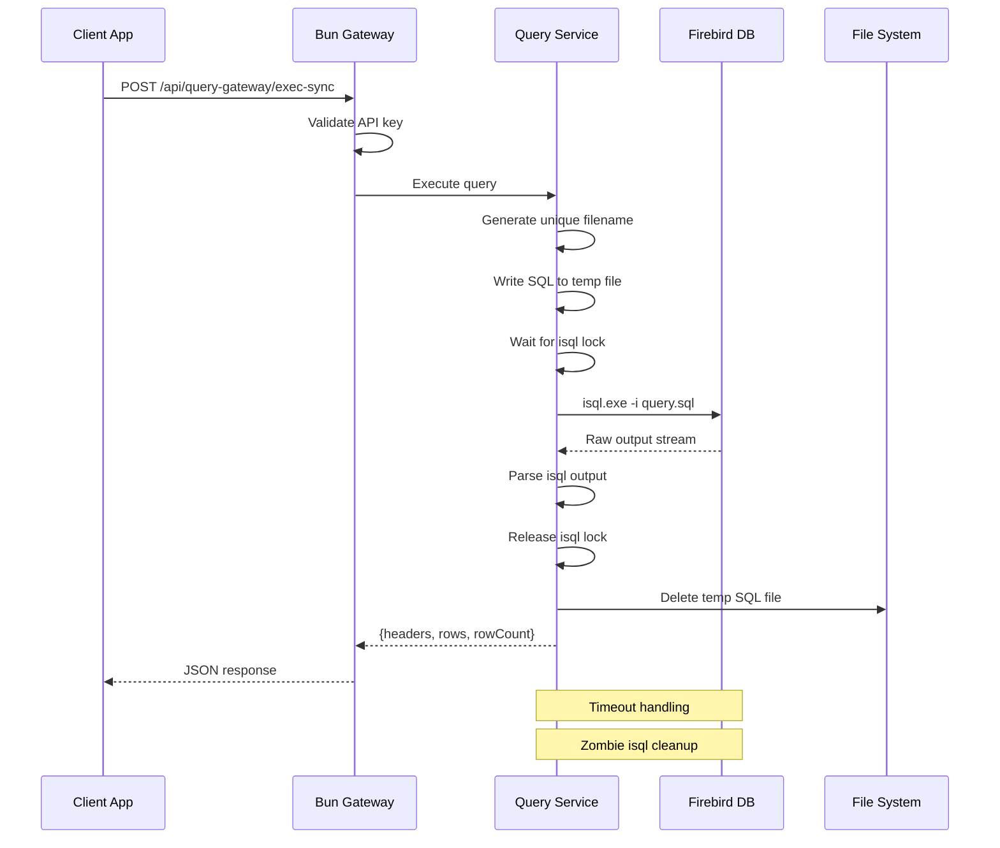
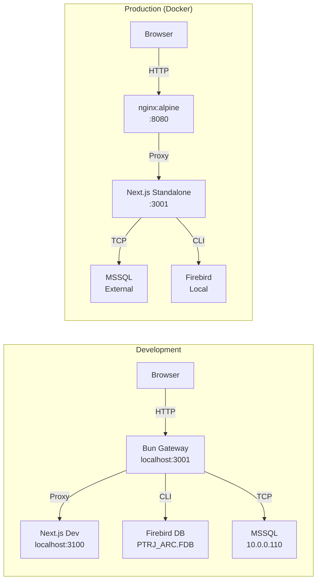
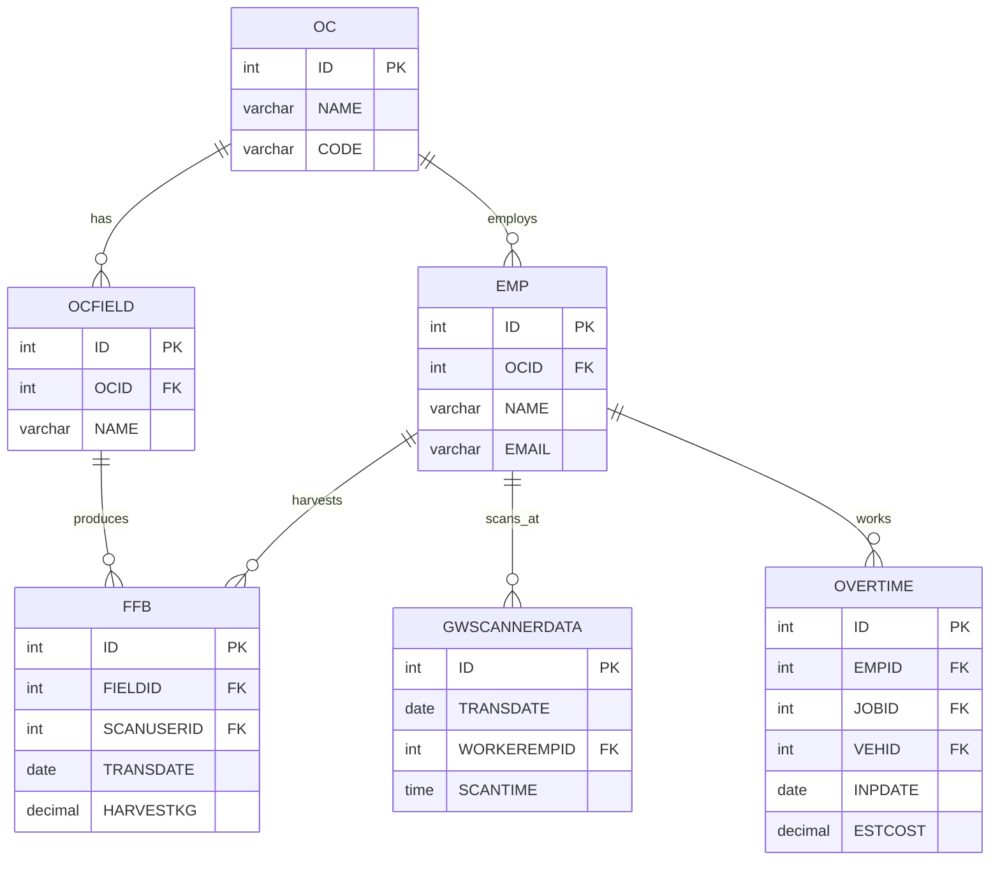
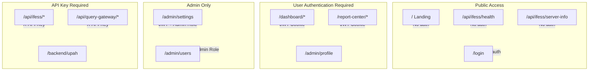

# Architecture Diagrams

This file contains comprehensive Mermaid diagrams for the PT Rebinmas Jaya Dashboard system.

## System Context Diagram

## Container Architecture

## Authentication Flow

## iFESS Client Lifecycle

## Report Request Flow

## Query Gateway Flow

## Deployment Architecture

## Data Model Relationships

## Security Boundaries

---

**Generated**: 2026-07-18
**Diagrams**: 9 total
