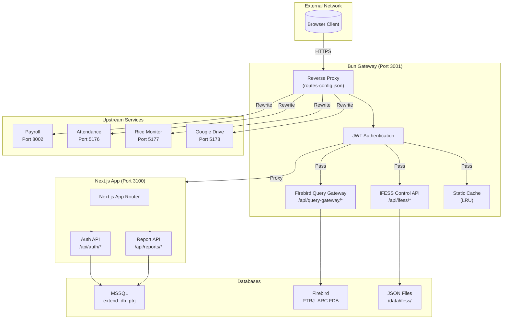
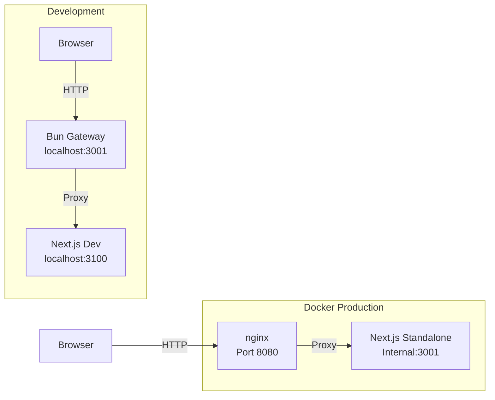
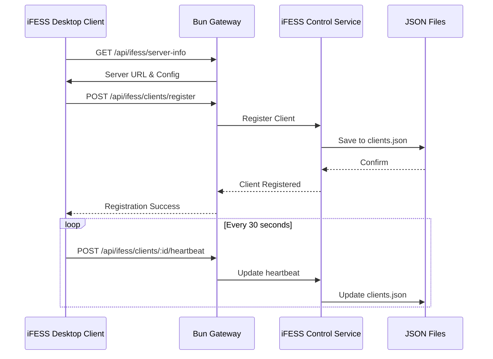
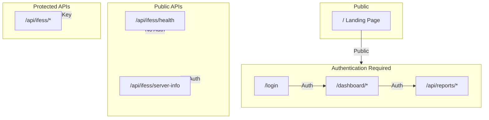

# System Architecture

## Architecture Overview

## Component Responsibilities

### Bun Gateway (`server_bun.js`)
| Component | Responsibility |
|-----------|----------------|
| Reverse Proxy | Routes requests to upstream services based on `routes-config.json` |
| JWT Auth | Verifies RS256 tokens, extracts user identity |
| iFESS Control API | Manages desktop client registration, heartbeats, commands |
| Query Gateway | Executes Firebird SQL, parses isql output |
| Static Cache | LRU cache for static assets (30min TTL) |

### Next.js Dashboard
| Component | Responsibility |
|-----------|----------------|
| App Router | Page routing with route groups |
| Auth API | Login, logout, token verification |
| Report API | MSSQL queries, report generation |
| Report Viewer | Generic renderer with filtering/export |

## Deployment Architecture

## iFESS Control Flow

## Communication Patterns

| Pattern | Protocol | Usage |
|---------|----------|-------|
| Browser → Gateway | HTTP | All client requests |
| Gateway → Next.js | HTTP | Dashboard proxy |
| Gateway → Upstreams | HTTP | Service proxies |
| Gateway → Firebird | CLI (isql) | SQL queries |
| Gateway → Storage | File I/O | JSON read/write |

## Security Boundaries

## External Integrations

| Service | Protocol | Auth | Purpose |
|---------|----------|------|---------|
| Payroll System | HTTP | Proxy | Wage management |
| Attendance System | HTTP | Proxy | Employee attendance |
| Google Drive | HTTP | Proxy | Document storage |
| Firebird DB | CLI | None | Scanner/production data |

---

**Evidence**: `server_bun.js:1-195`, `routes-config.json`, `CLAUDE.md`
